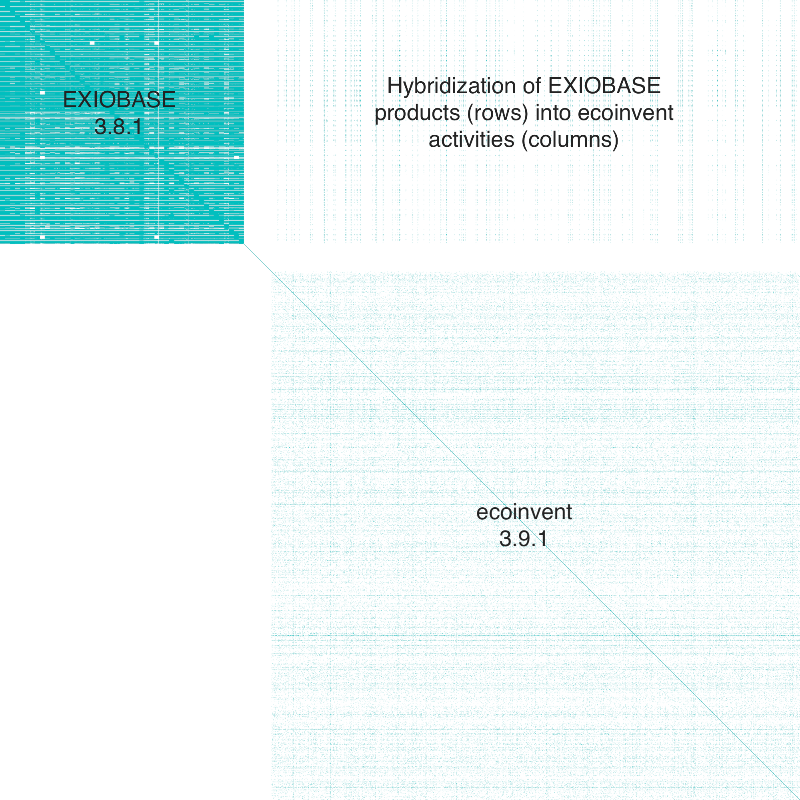
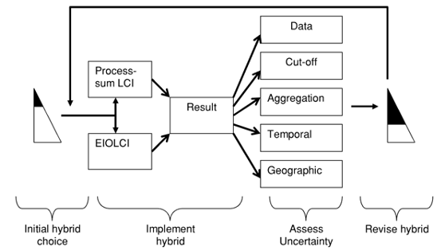
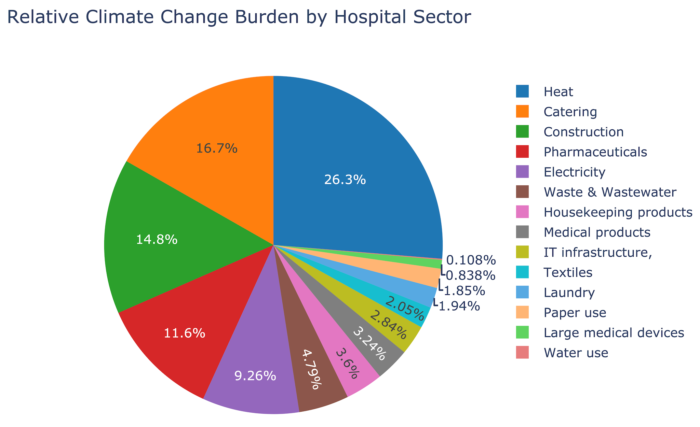
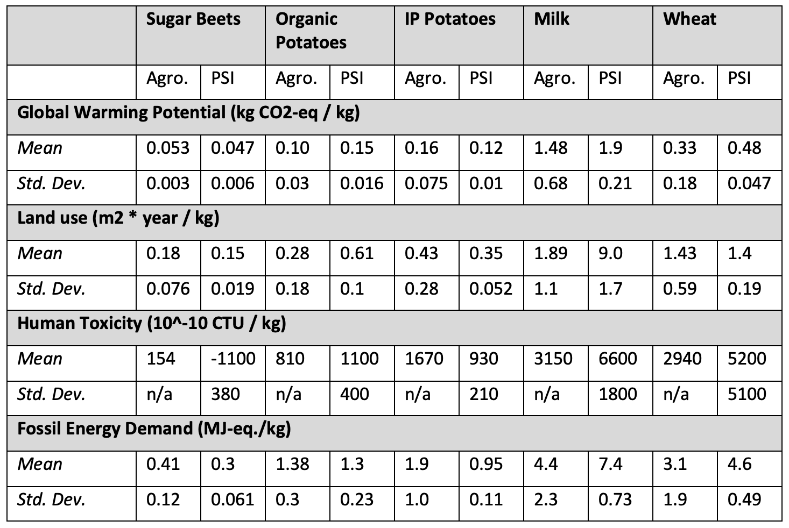
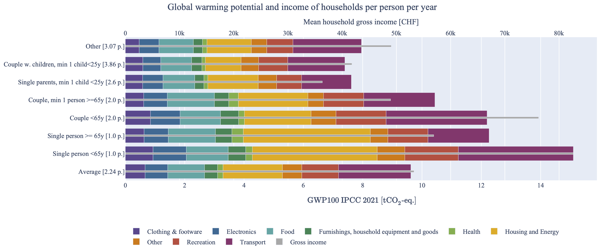
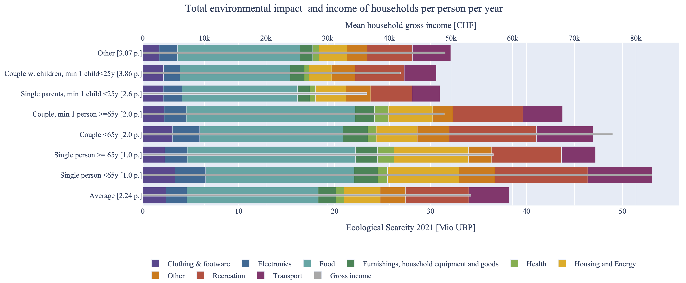
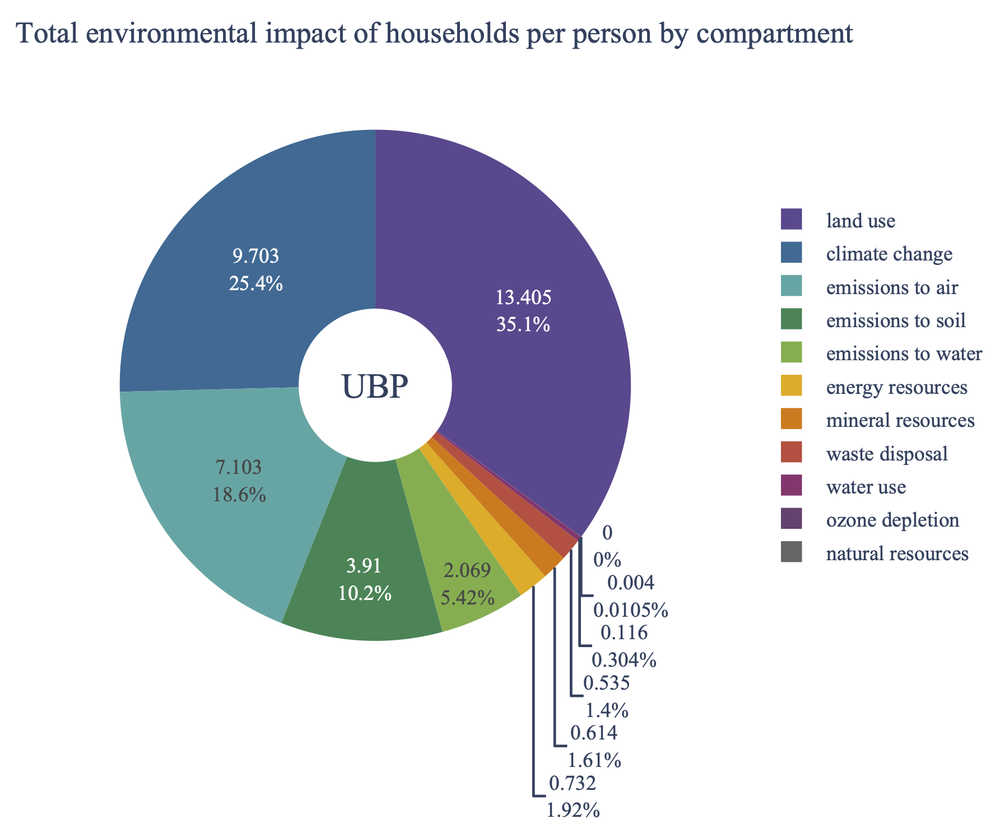
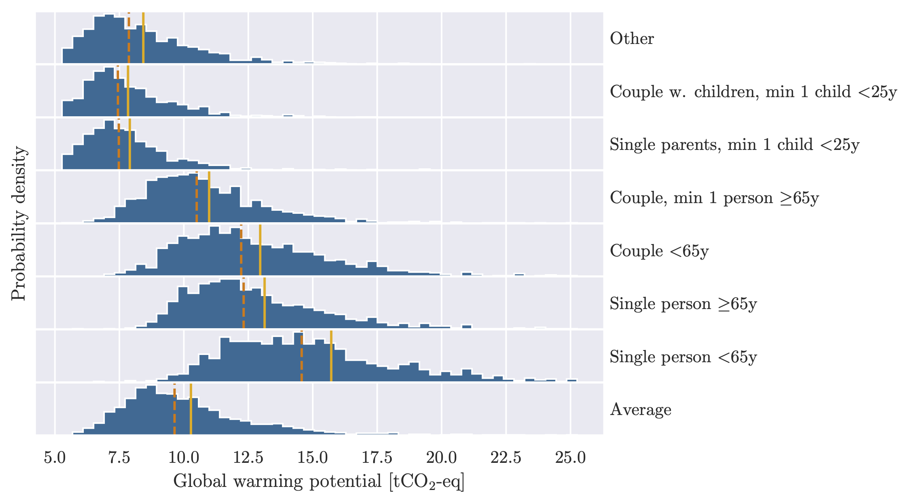

# NFP-73 Co-Creation Lab “Data Transparency for Sustainability” Final Deliverables Report

Chris Mutel, Arthur Jakobs, Aleksandra Kim, Christian Bauer, Michael Weinold, Peter Burgherr, Russell McKenna

PSI Technology Assessment Group

April 2023

<!-- MarkdownTOC -->

- [Summary](#summary)
- [Database Hybridization](#database-hybridization)
    - [Database Import](#database-import)
    - [Database Hybridization Software](#database-hybridization-software)
    - [Database Export](#database-export)
    - [Hybrid Database Visualization](#hybrid-database-visualization)
    - [Outlook](#outlook)
- [Consumption demand vector for Swiss household consumption](#consumption-demand-vector-for-swiss-household-consumption)
    - [Starting point](#starting-point)
    - [Technical updates to the python code parsing the model](#technical-updates-to-the-python-code-parsing-the-model)
    - [Changes to the LCA model](#changes-to-the-lca-model)
    - [Housing heating/fuel consumption mix](#housing-heatingfuel-consumption-mix)
    - [Electricity mix](#electricity-mix)
    - [Personal vehicle transport](#personal-vehicle-transport)
    - [Price conversion update](#price-conversion-update)
    - [Updates to the HABE expenditure survey final demand vector](#updates-to-the-habe-expenditure-survey-final-demand-vector)
    - [Availability of physical consumption data](#availability-of-physical-consumption-data)
    - [Electricity](#electricity)
    - [Natural gas and other fuels \(heating\)](#natural-gas-and-other-fuels-heating)
    - [Refuse collection, waste-water collection, and water consumption](#refuse-collection-waste-water-collection-and-water-consumption)
- [Database validation](#database-validation)
    - [Anthropogenic carbon dioxide and methane fluxes](#anthropogenic-carbon-dioxide-and-methane-fluxes)
    - [Mining production volumes](#mining-production-volumes)
    - [Other mass balance efforts with ecoinvent](#other-mass-balance-efforts-with-ecoinvent)
- [Comparison with NFP73 partner project data](#comparison-with-nfp73-partner-project-data)
    - [Green Hospitals](#green-hospitals)
    - [Interaction of economy and ecology in Swiss farms](#interaction-of-economy-and-ecology-in-swiss-farms)
    - [OASES](#oases)
- [Results of the household consumption model](#results-of-the-household-consumption-model)
- [Contribution analysis GWP100 and UBP](#contribution-analysis-gwp100-and-ubp)
- [Uncertainty analysis of household types](#uncertainty-analysis-of-household-types)
- [Footnotes](#footnotes)

<!-- /MarkdownTOC -->

## Summary

We have generated environmental footprints of Swiss household consumption using a hybridized ecoinvent-EXIOBASE database. We consider our results to be the best available so far, and our hybridized database, using ecoinvent 3.9.1 (cut-off system model) and EXIOBASE 3.8.1, is the most comprehensive and up-to-date for such footprint accounting.

We provide results for the global warming potential (2021 IPCC AR6, 100-year timeframe) and ecological scarcity (2021) impact assessment methods. We characterize the average Swiss household, and 106 household archetypes, divided across location, income class, and household size. We also provide individual impacts for 208 separate consumption categories. For all indicators, we provide mean results together with uncertainty descriptors. These results are [openly available and included with this report](https://github.com/OASES-project/CCL-results). We also include the executable Python notebooks needed to reproduce our study.

We performed some basic validation tasks on our hybridized database, and compared our results and input data with outputs from three NFP73 projects.

## Database Hybridization

### Database Import

Currently, two separate Python packages are being used to prepare the life-cycle inventory database and the input-output database for ingestion into the main classes of [pylcaio](https://github.com/MaximeAgez/pylcaio).

The [ecospold2matrix](https://github.com/majeau-bettez/ecospold2matrix) package is used to extract activities and associated exchanges from the [Ecoinvent](https://ecoinvent.org/) database spold files. The package thereafter builds the matrices required by pylcaio. To improve performance, increase modularity and utilize existing functionality available through [Brightway](https://documentation.brightway.dev/) packages (i.e. [bw2io](https://github.com/brightway-lca/brightway2-io/), [bw2calc](https://github.com/brightway-lca/brightway2-calc/), etc.), the core functionality of constructing the Leontief coefficient matrix (**A**-matrix) and the matrix holding the factors of production (“flow” matrix) from individual activity datasets is currently being integrated into various Brightway packages.

The [pymrio](https://github.com/konstantinstadler/pymrio) package is used to extract trade tables from the [Exiobase](https://exiobase.eu/) database csv files. The package thereafter builds the input-output matrices required by pylcaio. However, the most [recent published documentation](http://fp7desire.eu/documents/) of the Exiobase database no longer describes the content of these matrices correctly, since major updates to the structure of the database were released in 2016. To ensure consistency with current scientific conventions[^4] and to accelerate the process of building on existing tools, a compendium of all matrices relevant to the hybridization of input-output tables was created. The information associated with each matrix includes the dimensions, the row/column schema, the list and associated sources of satellite accounts and alias names used by pylcaio, pymrio and scientific literature.

[^4]: Miller & Blair, 2012. [Input-Output Analysis](https://doi.org/10.1017/CBO9780511626982).

### Database Hybridization Software

The model from Froemelt et al.[^1] based on ecoinvent and EXIOBASE was further hybridised using a tiered hybrid LCA model developed and published by Agez et al.[^5] and Agez et al[^6]. We employ this model to correct for the truncation errors in the process LCA (ecoinvent) part of the model, i.e. the underestimation of impacts due to the truncation of supply chains arising from incomplete data.

[^5]: Agez, M., Muller, E., Patouillard, L., Södersten, C.-J.H., Arvesen, A., Margni, M., Samson, R., Majeau-Bettez, G.: [Correcting remaining truncations in hybrid life cycle assessment database compilation](https://onlinelibrary.wiley.com/doi/epdf/10.1111/jiec.13132). Journal of Industrial Ecology, 1–13 (2021).

[^6]: Agez, M., Wood, R., Margni, M., Strømman, A. H., Samson, R., and MajeauBettez, G. (2020). [Hybridization of complete PLCA and MRIO databases for a comprehensive product system coverage](https://onlinelibrary.wiley.com/doi/abs/10.1111/jiec.12979). J. Indus. Ecol. 24, 774–790.

The [most recent implementation](https://github.com/OASES-project/pylcaio/blob/master/doc/Running_pyLCAIO.ipynb) of the hybridization functionality of pylcaio included a [number of errors](https://github.com/michaelweinold/bw_hybrid/issues/23) resulting from suboptimal handling of the underlying [Pandas](https://pandas.pydata.org/) `DataFrames`. These errors have been fixed, and various minor improvements were made to ensure the hybridization can be run independently of the operating system.

### Database Export

The pylcaio package includes a function to export the hybridized database object, an archive produced by the pylcaio package which includes a dictionary of DataFrames and sparse NumPy Arrays to Brightway. However, the required matching functions were never tested, currently throw an error related to a mismatch of impact factor names between the Exoinvent LCI and the Exiobase IO databases and thereby preclude the completion of the export function.

To overcome this challenge, we developed a new set of functions building on [Brightway datapackages](https://github.com/brightway-lca/bw_processing) and [IO table databases](https://github.com/brightway-lca/brightway2-data/blob/4.0.DEV19/bw2data/backends/iotable/backend.py#L16 ) to export EXIOBASE in a compatible and consistent way.

### Hybrid Database Visualization

*
Figure 1
*

The integrated hybrid database is shown in Figure 1. The structure of ecoinvent and EXIOBASE can be clearly seen, as well as the hybridization of EXIOBASE products being consumed by ecoinvent activities. Note the pattern of hybridization – only 6200 of the 21000 ecoinvent activities consume products from EXIOBASE, and only certain EXIOBASE products are consumed. This pattern results from the algorithms used to prevent double-counting.

### Outlook

*
Figure 2: Proposal for hybrid life-cycle assessment as part of an iterative process to reduce uncertainty. Adapted from [Williams et al.](https://doi.org/10.1111/j.1530-9290.2009.00170.x)
*

The use of hybrid life-cycle assessment as part of the present research project has shown the utility in improving the accuracy of life-cycle assessment studies. However, several other hybridization methods have been proposed, and few publications provide direct comparisons[^7].  Development efforts are currently focusing on integrating these approaches into Brightway to ensure the method most appropriate to a specific study can be applied without the need for bespoke software development.

The hybrid method used in the present research project can be adapted to allow the extension of process-based life-cycle inventories into the future, based on the economic and technological projections contained in the shared socio-economic scenarios of different integrated assessment models (IAMs). A similar workflow is already applied for purely process-based life-cycle assessment in the software package premise[^8], which is fully integrated with the Brightway ecosystem. However, the hybridization of inventory data is not currently part of the software package. Any development in this direction would therefore complement existing work to get closer to the vision of Gibon et al.[^9] that called for "a methodology for integrated, multiregional life-cycle assessment scenarios under large-scale technological change".

The methodological contributions of the research project could also be adapted by researchers in their own life-cycle assessment workflow. Hybrid inventories could be used outright or as part of an iterative process to extend the process-based inventory as suggested by Suh et al[^10]. This would greatly improve the accuracy of environmental impact assessment of ongoing research projects.

[^7]: Luo et al. (2020): https://doi.org/10.1021/acs.iecr.0c04709

[^8]: https://github.com/polca/premise

[^9]: Gibon et al. (2015): https://doi.org/10.1021/acs.est.5b01558

[^10]: Suh et al. (2003): https://doi.org/10.1021/es0263745

## Consumption demand vector for Swiss household consumption

### Starting point

In 2018 Froemelt et al.[^1] published a footprint study of Swiss household consumption based on the [household budget (HABE)](https://www.bfs.admin.ch/bfs/en/home/statistics/economic-social-situation-population/surveys/hbs.html) survey by the [Swiss federal office for statistics (BFS)](https://www.bfs.admin.ch/bfs/de/home.html). Froemelt et al.[^1] modelled the carbon footprint impact of Swiss households with a life cycle assessment model using both ecoinvent version 3.3 and the multiregional input output model EXIOBASE (version 2.2, year 2007). The consumption footprint for Swiss households was based on the HABE survey data for the years 2009-2011. We have updated the LCA model to accommodate the latest HABE survey data (2015-2017) and allow for the use of up to date versions of ecoinvent (3.9.1) and EXIOBASE (3.8.1, year 2015). In the following we describe the various steps that were applied to accommodate the update to the latest survey data.

[^1]: Froemelt, A., Dürrenmatt, D. J., and Hellweg, S. (2018). [Using data mining to assess environmental impacts of household consumption behaviors](https://pubs.acs.org/doi/10.1021/acs.est.8b01452). Environ. Sci. Technol. 15, 8467–8478.

### Technical updates to the python code parsing the model

Various technical updates were required to the python code, developed by Kim et al. (2022)[^2],
linking the consumption LCA model from Froemelt et al.[^1] to the updated databases of ecoinvent and EXIOBASE. These technical changes also include adding the option to add uncertainty to the final demand, based on the variance in demand between the households.

[^2]: Kim, A., Mutel, C., Froemelt, A., Hellweg, S. (2022). [Global Sensitivity Analysis of Background Life Cycle Inventories](https://pubs.acs.org/doi/10.1021/acs.est.1c07438). Environ. Sci. Technol. 56, 5874-5885.

### Changes to the LCA model

The LCA model from Froemelt et al.[^1] links the consumption categories from the HABE survey to reference products from ecoinvent processes as well as EXIOBASE product groups.

As some of these products or services are changing over time, for example the shares of the various heating sources used by Swiss households is different in 2017 compared to what it was in 2011, we have updated these coefficients to the years of the survey or later. Below we describe which product groups have been updated and what data was used to do so.

### Housing heating/fuel consumption mix

The heating demand of Swiss households is modelled as with physical process data for different heat energy carriers as described in Froemelt et al[^1]. We updated the shares of the different heat energy carriers using data from the Swiss federal office for Energy (BFE) on the [energy consumption for households](https://pubdb.bfe.admin.ch/de/publication/download/11198). We used the average mix in the years 2015-2017 to update the three main heat energy carriers modelled by Froemelt et al[^1]: oil, gas, and wood. We note that the other heat energy carriers are covered by electricity consumption or only constitute a minor share of the heat consumption by households in Switzerland. The oil and wood energy carriers were further split into different types using the same shares in Froemelt et al[^1].

### Electricity mix

The electricity grid mix is automatically updated by using the newer version of ecoinvent. The electricity consumption for all households is modelled using the electricity market mix for Switzerland.

### Personal vehicle transport

 Froemelt et al.[^1] model the passenger vehicle transport through the consumption of gasoline and diesel from the HABE expenditure data. In doing so, a passenger vehicle fleet composition was used to model a mix of different vehicles with their specific environmental performances. We updated the passenger vehicle fleet composition using data from Sacchi & Bauer[^3] to the 202 vehicle fleet composition.

[^3]: Sacchi, R., Bauer, C. (2022) Life cycle inventories for on-road vehicles. Paul Scherrer Institut, Villigen, Switzerland

### Price conversion update

The expenditures in HABE expenditure data are provided in CHF purchaser prices, whereas the EXIOBASE model is given in Euro and basic prices (excluding taxes, levies, and transport margins). As such Froemelt et al.[^1] calculated conversion factors accounting for the different currencies and price models used. We have update these margins using the CHF-Euro exchange rate for 2011 and 2017 as obtained from [Eurostat](https://ec.europa.eu/eurostat/databrowser/view/tec00033/default/table?lang=en).

### Updates to the HABE expenditure survey final demand vector

To use the HABE survey results data, a few preprocessing and data cleaning steps are required. Here we describe the preprocessing steps that were taken and updates to these steps as compared to Froemelt et al.[^1].

### Availability of physical consumption data

The expenditure of 12 product categories modeled in physical units were not available as physical quantities in the HABE data for 2009-2011. As such Froemelt et al.[^1] converted the expenditures for these categories [^a] to kilograms consumed using data on prices and weights from Swiss retailers. In the HABE data for 2015-2017 however, these product categories are available as physical quantities, allowing us to forego this conversion step and use the ‘raw’ expenditure data instead.

There are 5 product categories in the HABE survey that are provided as monetary expenditures only, but that are nonetheless modeled with physical process data from ecoinvent. For these product categories the expenditures must be converted to physical demand. Here we describe the conversion and data cleaning steps needed to include convert the following categories from expenditure data to physical demands.

[^a]: ‘Bakery products’, ‘Sandwich, Fresh eggs, processed eggs’, ‘Culinary herbs’, ‘Confectionery’, ‘Other sugar or cocoa based foods’, ‘Sauces, seasonings and spices’, ‘Soups and bouillons’, ‘Ready-to-cook meals’, ‘Vegetarian soy products’, ‘Newspapers and periodicals’, and ‘Body wash and bath additive’.

### Electricity

Following Froemelt et al.[^1] we use cantonal electricity prices obtained from [Swiss federal electricity committee ElCom](https://www.elcom.admin.ch/elcom/en/home.html). ElCom provides electricity prices on a cantonal level, for different consumption groups for each year. As we only know the total expenditure on electricity from the HABE data, we first followed Froemelt et al.[^1] in using an iterative approach to estimate the physical demand, determine the consumption group and then redetermining the physical demand based on the price for the determined consumption group. However, the average physical electricity demand we obtained with this iterative approach was well below the national average for households for the years 2015-2017 as taken from BFE. We therefore dropped the iterative approach and instead resorted to using cantonal average prices per year which yielded an average electricity demand close to the Swiss national average for households for the years 2015-2017 (422 kWh/household/month from the HABE data vs 430kWh/household/month from BFE for 2017).

### Natural gas and other fuels (heating)

In the HABE data for 2015-2017 only 4255 households, out of the 9955 households that were surveyed, have expenditure data on either fuels or district heating. As such we assigned each household the Swiss national average for the year in which they were surveyed.

### Refuse collection, waste-water collection, and water consumption

To covert the expenditure on ‘refuse collection’, ‘waste-water collection’, and ‘water supply fees’ to physical quantities, we used the prices provided by Froemelt et al.[^1] 2018 (suppl. material). These prices are given for different household types. However, as with the survey data on heating/fuel consumption, 59-80% of the households do not have expenditure data for these categories. These households were assigned the average physical expenditure for the other households.

## Database validation

### Anthropogenic carbon dioxide and methane fluxes

In theory, the fluxes of anthropogenic carbon dioxide and methane calculated by background databases should be similar to the values measured by earth systems scientists. To check on these values, we summed the total fossil carbon dioxide and methane (i.e. the flows labelled `Carbon dioxide, fossil` and `Methane, fossil`) multiplied by the indicated product volume amounts of all activities in ecoinvent 3.9.1 (cut-off system model), and compared these values with the [2022 Global Carbon Budget](https://essd.copernicus.org/articles/14/4811/2022/essd-14-4811-2022.html) and [2017 Global Methane Budget](https://essd.copernicus.org/articles/12/1561/2020/essd-12-1561-2020.html) figures. ecoinvent data is claimed to be representative of the year of publication (i.e. 2022); high-quality comprehensive methane figures past 2017 were not available.

The initial comparison revealed unrealistic values for carbon dioxide fluxes from natural gas and coal heating in ecoinvent. Similar results have [been observed for earlier ecoinvent versions](https://chris.mutel.org/images/22_Mutel_Climate_LCA_DF_78.pdf). Therefore, the following activities were ignored in the final carbon dioxide calculations:

| Name | Unit | Location |
| --- | --- | --- |
| heat production, natural gas, at boiler fan burner low-NOx non-modulating <100kW | megajoule | RoW |
| heat production, natural gas, at boiler atmospheric low-NOx non-modulating <100kW | megajoule | RoW |
| heat production, natural gas, at boiler atmospheric non-modulating <100kW | megajoule | RoW |
| heat production, natural gas, at boiler fan burner non-modulating <100kW | megajoule | RoW |
| heat production, natural gas, at boiler modulating <100kW | megajoule | RoW |
| heat production, natural gas, at boiler atm. low-NOx condensing non-modulating <100kW | megajoule | RoW |
| heat production, natural gas, at boiler condensing modulating <100kW | megajoule | RoW |
| heat production, at hard coal industrial furnace 1-10MW | megajoule | RoW |

No data cleaning was needed for the methane calculations.

| Flow | Measured Amount | ecoinvent Amount | Unit |
| --- | --- | --- | --- |
| CO2 | 37.1 | 37.7 | 10^12 kg CO2 |
| CH4 | 345-383 | 199 | 10^9 kg CH4 |

The CO2 fluxes (minus the heating activities removed) are very similar, which is a good sign, as carbon is one of the easiest material flows to estimate. However, we note that the global carbon budget includes some estimates from GTAP, meaning that the ecoinvent and Global Carbon Budget figures are not independent; they are using some of the same input data to reach their final totals. Therefore, the close agreement between these two numbers is probably mostly due to them using the same normalization references.

The CH4 flux numbers in ecoinvent have reasonable agreement with observed data, given the rapid scientific progress in estimating anthropogenic emissions and in the significant geographical heterogeneity in these fluxes.

### Mining production volumes

| Metal | Production volume   ecoinvent   (kt)| Production volume   real world   (kt) | Reference year| Source |
|--------------|:-----:|:---:|:--:|---|
| Copper | 16.3 | 24.8 | 2021 |[Statista](https://www.statista.com/statistics/254917/total-global-copper-production-since-2006/), last accessed April 6, 2023 |
| Aluminium | 69.0 | 136,000 | 2020 | [U.S. Geological Survey Jan 2021](https://pubs.usgs.gov/periodicals/mcs2021/mcs2021-bauxite-alumina.pdf), last accessed April 6, 2023 |
| Iron | 665,633 | 1,630,000 | 2021 | [U.S. Geological Survey Jan 2022](https://pubs.usgs.gov/periodicals/mcs2022/mcs2022-iron-ore.pdf), last accessed April 6, 2023 |

We performed a validation check on the production volumes covered by the ecoinvent database version 3.9.1 for copper, aluminium (bauxite measured as alumina), and iron ores. While the total fluxes of CO2 and CH4 were reasonable, the mining production volumes differ significantly from the reference data. We do not draw any specific conclusions from these disagreements, as production volumes in ecoinvent are currently only used to determine the relative share of different producers in regional commodity markets, and therefore are indicative of overall data quality but do not directly effect LCIA scores.

### Other mass balance efforts with ecoinvent

We have been in contact with three other teams looking at improving mass balances in ecoinvent:

* The ecoinvent technical team themselves, who are looking at mass balances in the quantitative properties for each technosphere and elementary flow.
* Maxime Agez and Han de Wachter from [Ciraig](https://ciraig.org/) in Montreal, who are using optimization to balance elementary flows across ecoinvent
* Antoine Beylot and Stephanie Müller from [BRGM](https://www.brgm.fr/fr) who are looking at mass balances in metal co-production value chains.

Although preliminary results were shared, this projects are still in early stages, but their outputs could contribute to future research in this area.

## Comparison with NFP73 partner project data

### [Green Hospitals](https://www.greenhospital.ch/index_en.html)

*
Figure 3
*

The Green Hospitals project was led by the group of Matthias Stucki at ZHAW. Their database is built using a combination of confidential hospital-specific data and a proprietary ZHAW database on food production and processing. As these two sources are not disclosable, we imported a data file produced by SimaPro which included only aggregated datasets. As the provided data covers only hospitals (not the whole health sector), and is aggregated, we can only show the relative drivers in environmental impact of an average Swiss hospital, shown above in Figure 3.

### [Interaction of economy and ecology in Swiss farms](https://nfp73.ch/en/projects/interaction-of-economy-and-ecology-in-swiss-farms)

The group of Thomas Nemecek at Agroscope has provided aggregated statistical data on the environmental performance (LCIA results) of sugar beets, cattle, cereals, milk, and potatoes, for nine impact categories. Their inventory data was gathered for each individual farm, but due to confidentiality measures only the average scores and their statistical properties could be used in this comparison. As the specific supply chains were not available, we can compare the Agroscope results instead of incorporating them into the hybrid database.

We compared the means and standard deviations for five products and four impact categories:

After several iterative data quality improvement rounds, we find the results from the hybrid database and the farm-specific data modelled with Agroscope tools to be quite similar. Differences in statistical properties come from the different types of uncertainty presented: variability across farms in the case of agroscope versus estimated uncertainties throughout the industrial supply chain in the case of ecoinvent.

The mean negative human toxicity of beets comes from the beets removing heavy metals from the soil; toxicity from ingestion of food products containing heavy metals is not considered in traditional LCIA.

The differences in milk production come from the inventory data source; ecoinvent does not have Swiss milk production datasets, but uses a mix of South Africa and Québec as a proxy for Switzerland.

### [OASES](https://nfp73.ch/en/projects/open-assessment-of-swiss-economy-and-society)

Our consumption vector uses the fleet average car. We additionally provide outputs from the OASES project and the [carculator model](https://carculator.psi.ch/) to allow individual users to estimate the environmental impacts of their specific car model and driving patterns.

## Results of the household consumption model

Here we present a few key results from the analysis of the Swiss household consumption footprint. We note that the full results are provided in the datapackages that can be used for (online) calculation tool. The results presented here highlight a few possibilities of 
the updated consumption model and the available data. 

The full set of results is provided as a datapackage of which the structure is described in the repository readme.

The results of the household consumption impacts are provided for the average Swiss household as well as differentiated across the following demographic categories and combinations thereof. 

**Table 2: Demographic categories used for differentiation of the household consumption footprints**

| Region |	Monthly Income (CHF) |	Household Type |
| --- | --- | --- |
| Lac Léman region | 1st Quintile (<4914) | Single under 65 |
| Mittelland | 2nd Quintile (4914–7264) | Single over 65 |
| Northwest Switzerland | 3rd Quintile (7265–9990) | Pair both under 65 without other household members |
| Zürich | 4th Quintile (9991–13621) | Pair with at least one person over 65 without other household members |
| Eastern Switzerland | 5th Quintile (≥13622) | Single parent with children (at least one under 25) without other household members |
| Central Switzerland | | Parents with children (at least one under 25) without other household members |
| Ticino	 | | Other |

As to comply with the privacy rules of the Federal Statistics Office, the household clusters have a minimum size of 150 households. Combinations of the above demographic categories that had a sample size smaller than 150 households were aggregated, meaning that not all combinations are provided in the results datapackage.

## Contribution analysis GWP100 and UBP

*
Figure 4
*

Figure 4 shows the annual climate impact *per person* of household consumption for the average Swiss household, as well as the 7 household types distinguished by the Federal Statistics Office, differentiated according to consumption category. The narrow grey bars provide the *per person* annual gross income for the household. The number in brackets at the end of each household type name gives the average number of people (including children) for each household. These results were calculated using a deterministic approach, i.e. neither the sampling variance of households nor the uncertainties in the background database were considered.

*
Figure 5
*

*
Figure 6
*

Figure 5 shows the total environmental impact of household consumption using the [Ecological Scarcity indicator](https://www.bafu.admin.ch/bafu/en/home/topics/economy-consumption/economy-and-consumption-publications/publications-economy-and-consumption/eco-factors-switzerland.html, which includes impacts such as global warming potential, land use, and ecotoxicity in a single score (ecopoints, or Umweltbelastungspunkte UBP). The breakdown of the total impact for the average household by impact compartment is presented in Figure 6, which shows that land use and climate change dominate the environmental impacts of Swiss household consumption.

## Uncertainty analysis of household types

*
Figure 7
*

The updates to the household consumption model by the CCL project also included the option to do a full stochastic analysis, to take the sampling variance of household consumption (HABE) into account and provide impact distributions rather than static values. Figure 7 provides such *per person* distributions for the global warming potential impact of the 6 household categories as well as the average Swiss household. The yellow line and orange dashed line provide the mean and median of the distributions respectively. The histograms in figure 7 show the 1-99 percentile range of all samples.

Such an analysis shows that the variance between households is very high indeed. We note that these distributions also include the database uncertainty but that the variance of the distributions is dominated by the household sampling variance, i.e. the differences in consumption patterns between the households. 

## Footnotes
